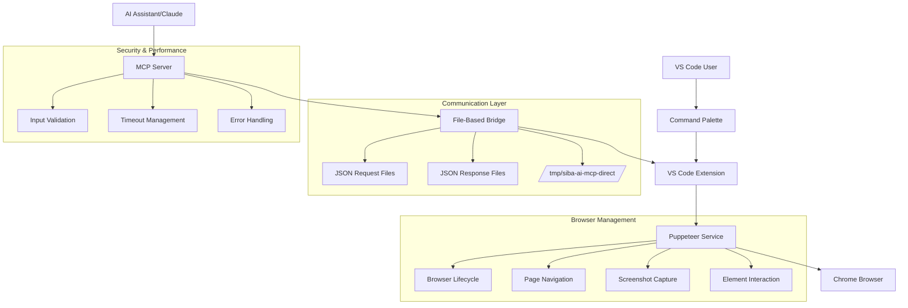

# SIBA AI Browser Extensions
[](https://marketplace.visualstudio.com/items?itemName=siba-tech.siba-ai-extensions)
[](https://github.com/kwkau/siba-ai-browser?tab=Apache-2.0-1-ov-file)
[](https://github.com/puppeteer/puppeteer)

> **Advanced VS Code extension enabling AI assistants to control external browsers through Puppeteer automation. Features comprehensive browser management, screenshot capture, web automation, form filling, JavaScript execution, specialized select dropdown automation, advanced DOM interaction for React/Vue apps, and full MCP bridge integration with 27 powerful tools for seamless AI-browser connectivity.**

## 🚀 Key Features

### 🎭 Puppeteer Browser Automation
- **External Browser Control**: Launch and control real Chrome/Chromium browsers via Puppeteer
- **Headless & Visible Modes**: Support for both background and visible browser automation
- **Real Browser Environment**: Full JavaScript execution, DOM manipulation, and web standards support
- **Advanced Automation**: Complex workflows, multi-step interactions, and browser state management

### 📸 Advanced Screenshot Capabilities
- **Full-Page Screenshots**: Capture complete page content including scrollable areas
- **Element-Specific Screenshots**: Target specific elements or regions
- **Multiple Formats**: Support for PNG, JPEG, and WebP formats with quality control
- **AI-Ready Output**: Base64 encoded images with automatic file saving
- **Custom Screenshot Logic**: User-configurable screenshot handling and storage

### 🤖 Comprehensive Browser Automation
- **16 MCP Tools**: Complete browser automation toolkit powered by Puppeteer
- **Advanced Element Interaction**: Click, hover, scroll, focus, double-click, right-click actions
- **Intelligent Form Automation**: Auto-detect input types, fill complex forms with validation
- **Smart Selectors**: CSS, XPath, text content, and ARIA selector support
- **Advanced DOM Interaction**: Shadow DOM, React/Vue component automation with piercing selectors
- **JavaScript Execution**: Run custom scripts in browser context with argument passing
- **File Operations**: Upload files with path validation and security checks
- **Text Extraction**: Get element text content and attribute values
- **Browser Management**: Launch, navigate, close browsers with full lifecycle control

### 🔗 MCP Protocol Integration
- **Model Context Protocol**: Industry-standard AI-extension communication
- **File-Based Bridge**: Robust communication system using JSON file exchange
- **Real-Time Automation**: Direct browser control from AI assistants
- **Claude Desktop Compatible**: External MCP client support
- **VS Code Native Integration**: Seamless integration with VS Code's extension ecosystem
- **Timeout Management**: 30-second timeout with proper error handling
- **Command Queuing**: Sequential command execution with response tracking

## 📦 Installation & Dependencies

### Prerequisites
- **VS Code**: Version 1.102.0 or higher
- **Node.js**: Version 18+ for Puppeteer support
- **Chrome/Chromium**: Automatically managed by Puppeteer

### From VS Code Marketplace
1. Open VS Code
2. Go to Extensions (`Cmd+Shift+X` / `Ctrl+Shift+X`)
3. Search for "SIBA AI Browser Extensions"
4. Click Install
5. Reload VS Code

### From Command Line
```bash
code --install-extension siba-tech.siba-ai-extensions
```

### Puppeteer Dependencies
The extension automatically manages Puppeteer dependencies:
- **Puppeteer**: v23.5.0 (latest stable)
- **Chrome Browser**: Auto-downloaded by Puppeteer on first run
- **System Requirements**: ~200MB for browser binaries

### Package Management
This project uses **yarn** as the package manager:
```bash
# Install dependencies
yarn install

# Build extension
yarn compile

# Build MCP server
cd mcp-server && yarn build
```

### MCP Configuration

#### Option 1: VS Code Native MCP (Recommended)
The extension automatically registers with VS Code's MCP system:
- **Automatic Registration**: No configuration required
- **VS Code Chat Integration**: Tools available in AI chat
- **Extension Management**: Managed through Extensions view
- **Status Bar Integration**: Real-time connection status

#### Option 2: Claude Desktop Integration
For external Claude Desktop usage, add to config file:

**macOS**: `~/Library/Application Support/Claude/claude_desktop_config.json`
**Windows**: `%APPDATA%/Claude/claude_desktop_config.json`

```json
{
  "mcpServers": {
    "siba-ai-browser": {
      "command": "node",
      "args": ["/ABSOLUTE/PATH/TO/PROJECT/mcp-server/build/index.js"],
      "env": {
        "MCP_CLIENT_TYPE": "claude",
        "NODE_ENV": "production"
      }
    }
  }
}
```

## 🛠️ Available MCP Tools (16 Total)

All tools use the `siba_ai_*` prefix for consistency:

### Core Browser Management (5 tools)
- **`siba_ai_launch_browser`** - Launch visible Puppeteer browser instance
- **`siba_ai_launch_browser_headless`** - Launch headless browser for background automation
- **`siba_ai_navigate_to_url`** - Navigate to URLs with security validation
- **`siba_ai_get_browser_status`** - Get comprehensive browser and page status
- **`siba_ai_close_browser`** - Close browser instances with cleanup

### Advanced Automation (9 tools)
- **`siba_ai_take_screenshot`** - Capture full-page or viewport screenshots with format options
- **`siba_ai_take_element_screenshot`** - Take screenshots of specific elements using advanced selectors
- **`siba_ai_fill_form`** - Fill complex forms with automatic input type detection
- **`siba_ai_interact_with_element`** - Perform click, hover, scroll, focus, double-click, right-click actions
- **`siba_ai_advanced_type_text`** - Type text with delay, auto-clear, and post-typing actions
- **`siba_ai_evaluate_javascript`** - Execute JavaScript with enhanced error handling and argument passing
- **`siba_ai_upload_file`** - Upload files to file inputs with path validation
- **`siba_ai_get_element_text`** - Extract text content from elements
- **`siba_ai_get_element_attribute`** - Get specific attribute values from elements

### React/Vue Advanced Automation (2 tools)
- **`siba_ai_advanced_dom_interaction`** - **NEW!** Advanced DOM interaction for React/Vue apps with Shadow DOM support
  - **Shadow DOM Piercing**: Use `>>>` and `>>>>` combinators to pierce through Shadow DOM boundaries
  - **XPath Selectors**: `::-p-xpath(//div[@class="example"])` for complex element targeting
  - **Text-Based Selection**: `::-p-text(Click me)` to find elements by their text content
  - **ARIA Selectors**: `::-p-aria(button)` for accessibility-based element selection
  - **Multiple Actions**: click, type, hover, focus, getAttribute, getText, scroll
  - **Configurable Options**: Custom timeout, typing delay, scroll behavior

### Tool Features
- **Advanced Selectors**: CSS, XPath, text content, and ARIA support
- **Timeout Management**: Configurable timeouts for all operations
- **Error Handling**: Comprehensive error reporting with actionable messages
- **Security Validation**: Input sanitization and path validation
- **Performance Optimization**: Efficient browser resource management

## 🎯 Quick Start & Usage

### Command Palette Commands
Access browser automation directly through VS Code:
1. Press `Cmd+Shift+P` (macOS) or `Ctrl+Shift+P` (Windows/Linux)
2. Type "SIBA AI" to see available commands:
   - **Launch Browser**: Start visible Puppeteer browser
   - **Launch Browser Headless**: Start background browser
   - **Take Screenshot**: Capture current page
   - **Get Browser Status**: Check active browser instances
   - **Navigate to URL**: Open specific URL
   - **Advanced DOM Interaction**: **NEW!** Interact with React/Vue apps using Shadow DOM selectors
   - **Close Browser**: Terminate browser instances

### Programmatic Usage (VS Code Extensions/Scripts)
```typescript
// Launch a visible browser
const browserId = await vscode.commands.executeCommand(
  'siba-ai-extensions.launchBrowser'
);

// Navigate to a URL
await vscode.commands.executeCommand(
  'siba-ai-extensions.navigateToUrl', 
  browserId, 
  'https://example.com'
);

// Take a screenshot
const screenshot = await vscode.commands.executeCommand(
  'siba-ai-extensions.takeScreenshot', 
  browserId
);

// Fill a form
await vscode.commands.executeCommand(
  'siba-ai-extensions.fillForm',
  browserId,
  pageId,
  {
    '#email': 'user@example.com',
    '#password': 'securepassword',
    'input[name="firstName"]': 'John'
  }
);

// Advanced DOM interaction for React/Vue apps
await vscode.commands.executeCommand(
  'siba-ai-extensions.advancedDomInteraction',
  browserId,
  pageId,
  'my-component >>> button.submit', // Shadow DOM piercing
  'click',
  { scrollIntoView: true, timeout: 10000 }
);
```

### MCP Client Usage (AI Assistants)
```typescript
// Launch browser via MCP
const launchResult = await mcpClient.callTool('siba_ai_launch_browser', {
  headless: false
});

// Navigate and screenshot workflow
await mcpClient.callTool('siba_ai_navigate_to_url', {
  browserId: launchResult.browserId,
  url: 'https://example.com'
});

const screenshot = await mcpClient.callTool('siba_ai_take_screenshot', {
  browserId: launchResult.browserId,
  fullPage: true,
  format: 'png'
});

// Advanced DOM interaction for React/Vue apps
const result = await mcpClient.callTool('siba_ai_advanced_dom_interaction', {
  browserId: launchResult.browserId,
  pageId: 'main',
  selector: '::-p-xpath(//div[@data-testid="submit-button"])',
  action: 'click',
  options: { timeout: 5000, scrollIntoView: true }
});
```

## 📊 Architecture & Communication



### Communication Flow
1. **MCP Client** sends tool requests to MCP server
2. **MCP Server** validates inputs and creates JSON request files
3. **VS Code Extension** monitors request directory and processes commands
4. **Puppeteer Service** executes browser automation
5. **Response** returns through JSON response files to MCP server
6. **MCP Server** formats and returns results to AI client

### File-Based Bridge Protocol
- **Request Directory**: `/tmp/siba-ai-mcp-direct/`
- **Request Format**: `cmd_${timestamp}_${id}.json`
- **Response Format**: `cmd_${timestamp}_${id}_response.json`
- **Timeout**: 30 seconds with automatic cleanup
- **Error Handling**: Comprehensive error reporting and recovery

## 🔒 Security & Performance

### Security Features
- **Input Validation**: Zod schema validation for all MCP tool parameters
- **Path Validation**: Secure file path handling for uploads and downloads
- **URL Sanitization**: Protocol restrictions (HTTP/HTTPS/file only)
- **Command Isolation**: Sandboxed command execution with timeout protection
- **Browser Sandboxing**: Puppeteer's built-in security sandbox
- **Error Sanitization**: Safe error message reporting without sensitive data exposure

### Performance Optimizations
- **Browser Reuse**: Efficient browser instance management and reuse
- **Connection Pooling**: Optimized Puppeteer connection handling
- **Screenshot Optimization**: Configurable quality and format options
- **Memory Management**: Automatic browser cleanup and garbage collection
- **Timeout Management**: 30-second timeout with proper resource cleanup
- **Request Queuing**: Sequential command processing to prevent conflicts

### Resource Management
- **Browser Lifecycle**: Automatic browser cleanup on extension deactivation
- **File Cleanup**: Automatic removal of temporary communication files
- **Memory Monitoring**: Efficient memory usage with Puppeteer optimizations
- **Error Recovery**: Graceful handling of browser crashes and timeouts

## 📝 Release Notes

### 1.2.0 (Current - August 6, 2025)
- 🎯 **Select Dropdown Revolution**: Specialized MCP tools for comprehensive select dropdown automation
- 🧠 **Intelligent Detection**: Auto-detection of selection methods with value → text → index fallback
- 🎭 **Multiple Selection**: Full support for multi-select dropdowns with array value handling
- 🏗️ **Optgroup Support**: Handles grouped options correctly with proper navigation
- ⚡ **Dynamic Content**: Works with AJAX-loaded options using configurable wait times
- 🎨 **Framework Compatible**: Supports React, Vue, Angular applications with proper event triggering
- 📋 **Enhanced Commands**: Added `selectDropdown` and `getSelectInfo` VS Code commands
- 🤖 **MCP Integration**: New `siba_ai_select_dropdown` and `siba_ai_get_select_info` tools

### 1.1.0 (August 4, 2025)
- 🚀 **Major Version Milestone**: Upgraded to v1.1.0 marking enhanced stability and feature completeness
- 🔄 **Close All Browsers**: New command and MCP tool for closing all browser instances simultaneously
- 🤫 **Silent Operation**: Complete notification suppression for uninterrupted AI automation
- 🎯 **Enhanced Automation**: Improved browser management with parallel closure operations
- 📋 **Version Synchronization**: All components aligned to v1.1.0 across extension and MCP server

### 1.0.16 (August 2, 2025)
- 🔧 **Version Consistency**: Aligned all package versions across extension and MCP server
- 📦 **Package Management**: Standardized versioning system for better deployment consistency
- 🚀 **Deployment Optimization**: Streamlined build and deployment process for marketplace releases
- 📋 **Documentation Updates**: Updated README and changelog with latest version information
- ⚙️ **Build System**: Improved version synchronization across multiple package.json files

### 1.0.11 (July 27, 2025)
- ✅ **Cross-Origin Communication**: Enhanced window.postMessage bridge system
- 🔧 **Message Passing Reliability**: Improved webview message handling with timeout and retry mechanisms
- 🛡️ **CORS Handling**: Strengthened cross-origin safety with multiple fallback strategies
- 📊 **Error Recovery**: Enhanced error handling for webview communication failures
- 🔄 **Communication Stability**: Resolved intermittent communication issues between MCP server and webview

### Previous Versions
- **1.0.10**: Working browser automation with 13 MCP tools and custom SIBA browser integration
- **1.0.9**: Authentic browser automation with complete mock response removal
- **1.0.8**: html2canvas integration for screenshot capture and VS Code Marketplace deployment
- **1.0.1**: Initial marketplace release with comprehensive MCP tools
- **1.0.0**: Production release with core screenshot and automation features

## 🤝 Contributing

We welcome contributions! Please follow these guidelines:

### Development Setup
1. **Clone the repository**:
   ```bash
   git clone https://github.com/kwkau/siba-ai-browser
   cd siba-ai-browser
   ```

2. **Install dependencies** (use yarn as per project conventions):
   ```bash
   yarn install
   cd mcp-server && yarn install
   ```

3. **Build the project**:
   ```bash
   yarn compile
   cd mcp-server && yarn build
   ```

### Development Guidelines
1. **Package Manager**: Always use `yarn` instead of npm (project convention)
2. **Module System**: Use ES modules (`import/export`) - never use `require()`
3. **TypeScript**: Follow strict mode requirements and type safety
4. **Tool Naming**: Use `siba_ai_*` prefix for all MCP tools
5. **Testing**: Include comprehensive tests for new features
6. **Documentation**: Update docs for API changes and new features
7. **Error Handling**: Use established error handling patterns

### Code Style
- Use TypeScript strict mode
- Follow existing naming conventions
- Include JSDoc comments for public APIs
- Use proper error handling with try/catch blocks
- Validate inputs using Zod schemas

### Testing
- Test all MCP tools with various inputs
- Verify Puppeteer browser automation scenarios
- Test file-based communication bridge
- Validate screenshot capture functionality
- Test error handling and edge cases

## 📋 Requirements

### System Requirements
- **VS Code**: Version 1.102.0 or higher
- **Node.js**: Version 18+ (required for Puppeteer)
- **Operating System**: Windows, macOS, or Linux
- **Memory**: Minimum 4GB RAM (8GB recommended for heavy automation)
- **Disk Space**: ~200MB for Puppeteer browser binaries

### Dependencies
- **Core**: `@modelcontextprotocol/sdk` v1.16.0
- **Browser**: `puppeteer` v23.5.0
- **Validation**: `zod` v3.25.76
- **Build**: TypeScript v5.8.3

## 📄 License

This project is licensed under the ISC License - see [LICENSE](LICENSE) file for details.

## 🆘 Support & Resources

- 🐛 **Bug Reports**: [Submit via GitHub Issues](https://github.com/kwkau/siba-ai-browser/issues)
- 💡 **Feature Requests**: [Submit via GitHub Issues](https://github.com/kwkau/siba-ai-browser/issues)
- � **Source Code**: [GitHub Repository](https://github.com/kwkau/siba-ai-browser)
- 📄 **License**: [Apache 2.0 License](https://github.com/kwkau/siba-ai-browser?tab=Apache-2.0-1-ov-file)
- ☕ **Support Development**: [Buy Me a Coffee](https://buymeacoffee.com/byq9t6syjyv)
- 💬 **Marketplace**: [VS Code Extension Page](https://marketplace.visualstudio.com/items?itemName=siba-tech.siba-ai-extensions)
- 📧 **Email Support**: support@siba-tech.com

### Documentation Resources
- **API Reference**: [mcp-server/API_REFERENCE.md](mcp-server/API_REFERENCE.md)
- **MCP Bridge Guide**: [docs/MCP_BRIDGE_GUIDE.md](docs/MCP_BRIDGE_GUIDE.md)
- **Testing Guide**: [docs/TESTING_GUIDE.md](docs/TESTING_GUIDE.md)
- **Deployment Guide**: [docs/DEPLOYMENT_GUIDE.md](docs/DEPLOYMENT_GUIDE.md)

---

**Made with ❤️ for the VS Code and AI automation community**

**Extension ID**: `siba-tech.siba-ai-extensions`  
**Publisher**: SIBA Tech  
**Version**: 1.2.1  
**Marketplace**: https://marketplace.visualstudio.com/items?itemName=siba-tech.siba-ai-extensions

### Browser Automation Powered by Puppeteer
This extension leverages [Puppeteer](https://github.com/puppeteer/puppeteer) v23.5.0 for reliable, high-performance browser automation that works with real Chrome/Chromium browsers.
