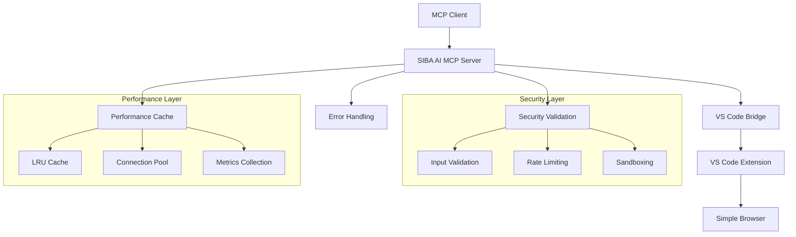

# SIBA AI MCP Server

[](https://www.typescriptlang.org/)
[](https://github.com/modelcontextprotocol/create-python-server)
[](https://code.visualstudio.com/)
[](LICENSE)

> **Enterprise-grade MCP server for VS Code Simple Browser automation with advanced security, performance optimization, and comprehensive error handling.**

## 🚀 Overview

The SIBA AI MCP Server is a production-ready Model Context Protocol (MCP) server that bridges VS Code extension functionality to make advanced browser automation capabilities easily accessible to Copilot and other MCP clients. Built with enterprise-level architecture, it provides comprehensive security validation, performance optimization, and robust error handling.

### Key Features

- 🎯 **16 Browser Automation Tools** - Complete DOM interaction, form automation, screenshot capabilities, and advanced React/Vue support
- 🔒 **Enterprise Security** - XSS prevention, injection protection, sandboxing, and rate limiting
- ⚡ **Performance Optimized** - LRU caching, connection pooling, and real-time monitoring
- 🛡️ **Robust Error Handling** - Standardized error codes, retry logic, and comprehensive logging
- 📊 **Real-time Analytics** - Performance metrics, security monitoring, and system health tracking
- 🔧 **Industry Standards** - JSON-RPC compliance, MCP ecosystem alignment, TypeScript-first
- 🚀 **Modern Framework Support** - Advanced DOM interaction for React, Vue, Angular with Shadow DOM piercing

## 📋 Tool Categories (16 Total)

### Core Browser Management (5 tools)
- `siba_ai_launch_browser` - Launch visible Puppeteer browser instance
- `siba_ai_launch_browser_headless` - Launch headless browser for background automation
- `siba_ai_navigate_to_url` - Navigate to URLs with security validation
- `siba_ai_get_browser_status` - Get comprehensive browser and page status
- `siba_ai_close_browser` - Close browser instances with cleanup

### Screenshot & Media (2 tools)
- `siba_ai_take_screenshot` - Capture full-page or viewport screenshots
- `siba_ai_take_element_screenshot` - Take screenshots of specific elements using advanced selectors

### Form & Input Automation (4 tools)
- `siba_ai_fill_form` - Fill complex forms with automatic input type detection
- `siba_ai_advanced_type_text` - Type text with delay, auto-clear, and post-typing actions
- `siba_ai_upload_file` - Upload files to file inputs with path validation
- `siba_ai_interact_with_element` - Perform click, hover, scroll, focus, double-click, right-click actions

### JavaScript & Advanced Operations (3 tools)
- `siba_ai_evaluate_javascript` - Execute JavaScript with enhanced error handling and argument passing
- `siba_ai_get_element_text` - Extract text content from elements
- `siba_ai_get_element_attribute` - Get specific attribute values from elements

### Modern Framework Support (2 tools)
- `siba_ai_advanced_dom_interaction` - **NEW!** Advanced DOM interaction for React/Vue apps
  - **Shadow DOM Piercing**: Use `>>>` and `>>>>` combinators
  - **XPath Selectors**: `::-p-xpath(//div[@class="example"])`
  - **Text-Based Selection**: `::-p-text(Click me)`
  - **ARIA Selectors**: `::-p-aria(button)`
  - **Multiple Actions**: click, type, hover, focus, getAttribute, getText, scroll

## 🔧 Installation

### Prerequisites

- Node.js 18+ with ES modules support
- VS Code with SIBA AI extension
- TypeScript 5.0+

### Setup

```bash
# Clone the repository
git clone https://github.com/your-org/siba-ai-extensions.git
cd siba-ai-extensions/mcp-server

# Install dependencies
npm install

# Build the server
npm run build

# Verify installation
node build/index.js --version
```

## ⚙️ Configuration

### Claude Desktop

Add to your Claude Desktop config (`~/Library/Application Support/Claude/claude_desktop_config.json`):

```json
{
  "mcpServers": {
    "siba-ai": {
      "command": "node",
      "args": ["/ABSOLUTE/PATH/TO/PROJECT/mcp-server/build/index.js"],
      "env": {
        "NODE_ENV": "production",
        "LOG_LEVEL": "error"
      }
    }
  }
}
```

### VS Code Integration

Create `.vscode/mcp.json` for development debugging:

```json
{
  "mcpServers": {
    "siba-ai": {
      "command": "node",
      "args": ["./build/index.js"],
      "cwd": "./mcp-server"
    }
  }
}
```

### Environment Variables

| Variable | Default | Description |
|----------|---------|-------------|
| `NODE_ENV` | development | Environment mode |
| `LOG_LEVEL` | info | Logging level (debug/info/warn/error) |
| `CACHE_SIZE` | 100 | Performance cache size |
| `MAX_CONNECTIONS` | 10 | Connection pool size |
| `RATE_LIMIT_REQUESTS` | 100 | Rate limit requests per window |
| `RATE_LIMIT_WINDOW` | 60000 | Rate limit window in milliseconds |

## 🔒 Security Features

### Input Validation
- **Zod Schema Validation** - Strict type checking for all inputs
- **XSS Prevention** - 30+ blocked patterns with HTML entity encoding
- **Injection Protection** - SQL injection and script injection detection
- **URL Validation** - Protocol restriction (HTTP/HTTPS/file only)

### Sandboxing
- **JavaScript Execution** - Restricted API access in code execution
- **Resource Limits** - Request size and execution time limits
- **Rate Limiting** - Token bucket algorithm with client tracking

### Security Monitoring
```bash
# Get real-time security statistics
curl -X POST http://localhost:3000/mcp \
  -d '{"method": "siba_ai_get_security_stats"}'
```

## ⚡ Performance Features

### Caching System
- **LRU Cache** - Least Recently Used eviction policy
- **TTL Support** - Time-to-live for cache entries
- **Cache Hit Monitoring** - Real-time hit rate tracking

### Connection Pooling
- **Resource Pooling** - Efficient VS Code bridge connections
- **Automatic Cleanup** - Idle connection disposal
- **Connection Limits** - Configurable pool size

### Performance Monitoring
```bash
# Get performance metrics
curl -X POST http://localhost:3000/mcp \
  -d '{"method": "siba_ai_get_performance_stats"}'
```

## 🛠️ Development

### Build Commands

```bash
# Development build with watch mode
npm run build:watch

# Production build
npm run build

# Type checking
npm run type-check

# Run linting
npm run lint

# Run tests
npm test
```

### Debug Mode

```bash
# Enable debug logging
NODE_ENV=development LOG_LEVEL=debug node build/index.js

# Test specific tool
echo '{"method": "siba_ai_take_screenshot"}' | node build/index.js
```

## 📊 Monitoring & Analytics

### Error Tracking
- **Structured Errors** - Standardized error codes and categories
- **Error Analytics** - Error rate tracking and trend analysis
- **Retry Logic** - Automatic retry with exponential backoff

### Performance Metrics
- **Response Times** - Average, P95, P99 percentiles
- **Throughput** - Requests per second monitoring
- **Success Rates** - Success/failure ratio tracking
- **Cache Performance** - Hit rates and cache utilization

### Security Analytics
- **Violation Tracking** - Security rule violation monitoring
- **Attack Detection** - Automated pattern recognition
- **Client Analysis** - Per-client security statistics

## 🔧 API Reference

### Selector Types

All browser automation tools support flexible element selection:

```typescript
interface Selector {
  type: 'css' | 'xpath' | 'text' | 'attribute' | 'id';
  value: string;
  options?: {
    timeout?: number;        // Wait timeout in ms
    waitForVisible?: boolean; // Wait for element visibility
    index?: number;          // Index for multiple matches
    caseSensitive?: boolean; // Case-sensitive text matching
  };
}
```

### Example Usage

```javascript
// Click a button using CSS selector
await siba_ai_click_element({
  selector: {
    type: "css",
    value: "button.submit-btn",
    options: { waitForVisible: true, timeout: 5000 }
  }
});

// Fill form input by ID
await siba_ai_fill_input({
  selector: { type: "id", value: "email-field" },
  value: "user@example.com"
});

// Execute JavaScript with sandboxing
await siba_ai_execute_javascript({
  code: "document.title",
  returnResult: true
});

// Upload files with validation
await siba_ai_upload_files({
  selector: { type: "css", value: "input[type='file']" },
  files: [{
    name: "document.pdf",
    type: "application/pdf",
    content: "base64-encoded-content"
  }]
});
```

## 🚨 Error Handling

### Error Structure

```typescript
interface MCPError {
  code: number;           // Standardized error code
  message: string;        // Human-readable message
  severity: string;       // LOW, MEDIUM, HIGH, CRITICAL
  category: string;       // VALIDATION, NETWORK, BROWSER, etc.
  retryable: boolean;     // Whether operation can be retried
  context: object;        // Additional error context
  timestamp: Date;        // Error occurrence time
}
```

### Common Error Codes

| Code | Name | Description | Retryable |
|------|------|-------------|-----------|
| -32100 | BROWSER_NOT_ACTIVE | Browser not available | ❌ |
| -32102 | ELEMENT_NOT_FOUND | Element not found | ✅ |
| -32007 | RATE_LIMIT_ERROR | Rate limit exceeded | ✅ |
| -32010 | VALIDATION_ERROR | Input validation failed | ❌ |
| -32008 | TIMEOUT_ERROR | Operation timeout | ✅ |

## 🔄 Migration Guide

### From v0.2.0 to v0.3.0

**Breaking Changes:**
- Tool names now use `siba_ai_*` prefix
- Enhanced security validation may reject previously accepted inputs
- Structured error responses with additional metadata

**Migration Steps:**
1. Update tool names in your code
2. Handle structured error responses
3. Review input validation requirements
4. Implement rate limiting considerations

```javascript
// Before v0.3.0
try {
  await server.call('take_screenshot');
} catch (error) {
  console.log(error.message);
}

// After v0.3.0
try {
  await server.call('siba_ai_take_screenshot');
} catch (error) {
  console.log(`[${error.code}] ${error.message}`);
  if (error.retryable) {
    // Implement retry logic
  }
}
```

## 🏗️ Architecture



## 🤝 Contributing

### Development Setup

1. **Fork** the repository
2. **Clone** your fork locally
3. **Install** dependencies: `npm install`
4. **Build** the project: `npm run build`
5. **Test** your changes: `npm test`

### Code Standards

- **TypeScript First** - All code must be strictly typed
- **Security Validation** - All inputs must be validated
- **Error Handling** - Use standardized error patterns
- **Performance** - Consider caching and optimization
- **Documentation** - Update docs for new features

### Pull Request Process

1. Create feature branch from `main`
2. Make changes with comprehensive tests
3. Update documentation and changelog
4. Ensure all builds pass
5. Request review from maintainers

## 📄 License

ISC License - see [LICENSE](LICENSE) file for details.

## 🆘 Support

- **🐛 Bug Reports**: [GitHub Issues](https://github.com/your-org/siba-ai-extensions/issues)
- **💡 Feature Requests**: [GitHub Discussions](https://github.com/your-org/siba-ai-extensions/discussions)
- **📖 Documentation**: [Developer Guide](DEVELOPER_GUIDE.md)
- **💬 Community**: [MCP Ecosystem Discord](https://discord.gg/mcp-ecosystem)

---

**Made with ❤️ for the MCP ecosystem**
